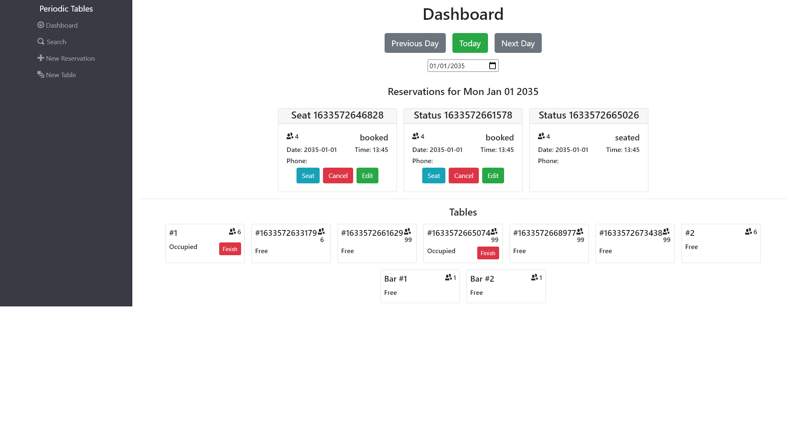

# Capstone project: Restaurant Reservation System

## Live demo:

[Restaurant Reservation System Demo](https://restaurant-res-client.herokuapp.com/dashboard)  

## Application Summary:

A Restaurant Reservation System intended for internal use by restaurant employees. 
The "dashboard" page displays existing reservations for a specific date as well as possible table seating options. Here, the user can navigate to past/future dates and edit/delete reservations, as well as assign them to tables and mark them complete.
The "create" page allows the user to create a new reservation within the restaurant's operating hours.
The "search" page allows the user to enter a mobile number to pull up any existing reservations that match. The phone number is automatically formatted.
The "new table" page allows for the creation of new tables to accommodate different party sizes.

## Screenshots

## Tech Stack:

This application was created using JavaScript, React, Node, Express, Knex, PostgreSQL, BootStrap, HTML, and CSS.

## API Documentation:

| Route       | Method      | Status Code | Description   |
| :---        |    :----:   |     :----:   |        :---  |
| /reservations      | GET   | 200  | Returns a list of reservations for the current date |
| /reservations?date=####-##-##      | GET |  200    | Returns a list of reservations for the given date |
| /reservations      | POST  | 201    | Creates a new reservation |
| /reservations/:reservation_id      | GET  | 200     | Returns the reservation for the given ID |
| /reservations/:reservation_id      | PUT  | 200     | Updates the reservation for the given ID |
| /reservations/:reservation_id/status      | PUT  | 200     | Updates the status of the reservation for the given ID |
| /tables   | GET  | 200      | Returns a list of tables     |
| /tables   | POST  | 201      | Creates a new table     |
| /tables/:table_id   | GET   |   200   | Returns the table for the given ID     |
| /tables/:table_id/seat   | PUT | 200      | Seats a reservation at the given table_id     |
| /tables/:table_id/seat   | DELETE  | 200      | Changes the occupied status to be unoccupied for the given table_id     |

## Installation:

Install required dependencies: 
`npm install`

Launch development server and site preview:
`npm start start:dev`

Run tests 
`npm test`
